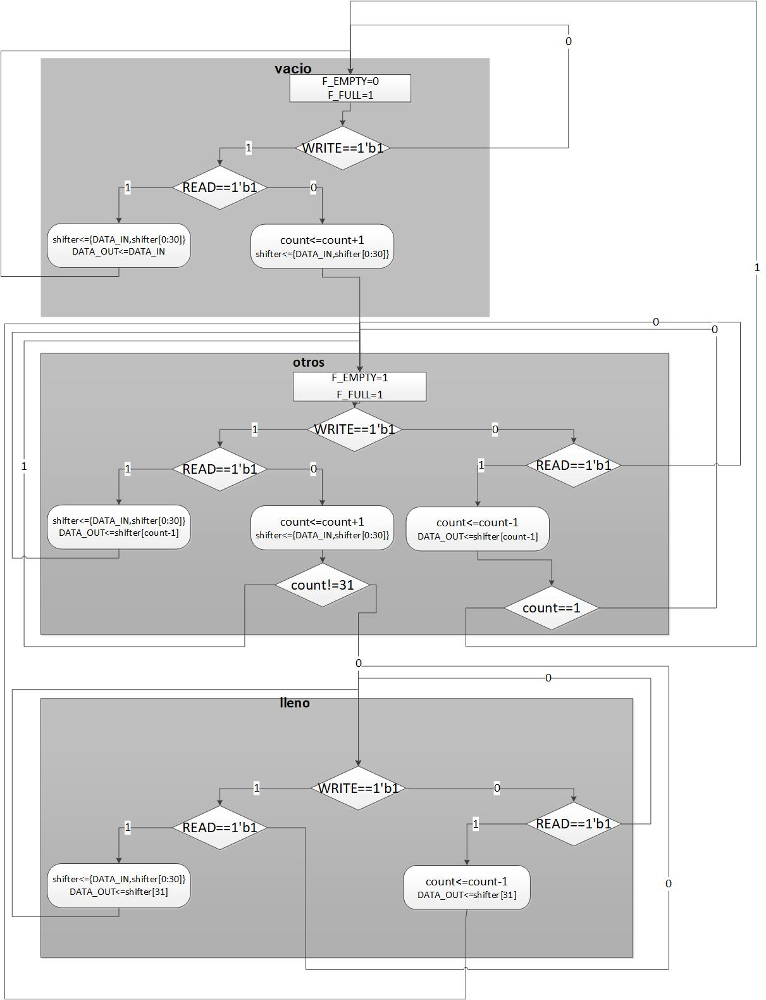

# INSTRUCCIONES

Este repositorio ha sido creado para :
- Servir como punto de partida de vuestra primera tarea. 
- Servir para el equipo con el fin de tener un control de versiones adecuado y por último 
- Servir como alojamiento del entregable que constará fundamentalmente y necesariamente de los dos subdirectorios identificados como entregables y que contienen a su vez instrucciones específicas para hacer una entrega correcta.

Se os ha colocado un ejemplo de entregable para que veais cómo debería ser la entrega

## Diseño
Se os proporciona el componente fundamental del data-path que no es otro que un shifter 2D. Este compoenente será descrito, y explicado en las sesiones de teoría y se puede observar que ejercerá todo el papel asociado a la variable "shifter" del siguiente ASM solución de la FIFO

 

## Verificación

Se os proporciona un ejemplo completo de verificación con systemverilog de una FIFO, en este caso basada en una RAM de doble puerto.

Si quereis ejecutar el ejemplo, muévete al directorio ejemplo_entregable/verificacion_entegable y ejecuta

` vsim -do script_rtl_2018_ver1.do `

- en caso de trabajar con linux
- en el caso de trabajar con windows , ejecuta el mismo script una vez arrancado questasim

En el caso que quieras utilizar este banco de pruebas en vuestro diseño:
1. Añadid vuestros ficheros de diseño al subdirectorio de diseño  del ejemplo
2. Modificad el script para que compile vuestros ficheros fuente del diseño (en lugar de los de la FIFO basada en RAM)
3. Y por supuesto no os olvidéis de sustituir en el fichero fifo_top_duv (que se encuentra en el subdirectorio de verificación)  la FIFO instanciada. Ahora debería instanciar vuestra FIFO .

