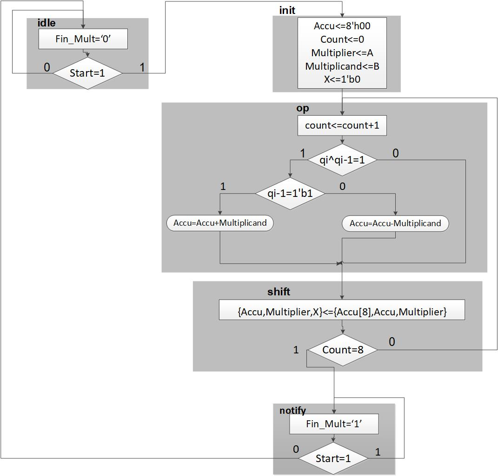
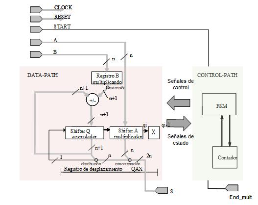

# INSTRUCCIONES

Este repositorio ha sido creado para :
- Servir como punto de partida de vuestra segunda tarea tarea. 
- Servir para el equipo con el fin de tener un control de versiones adecuado y por último 
- Servir como alojamiento del entregable que constará fundamentalmente y necesariamente de los dos subdirectorios identificados como entregables y que contienen a su vez instrucciones específicas para hacer una entrega correcta.

Se os ha colocado un ejemplo de entregable para que veais cómo debería ser la entrega

## Diseño
Se os proporciona el ASM de la solución

 

Para ayudaros a la visión general de los componentes generales necesarios que se implican por el ASM anterior, incluimos el siguiente esquema:

 

## Entregable

Se os proporciona un ejemplo completo de entregable que consiste en la verificación con systemverilog de una FIFO, en este caso basada en una RAM de doble puerto.

Si quereis ejecutar el ejemplo, muévete al directorio ejemplo_entregable/verificacion_entegable y ejecuta

` vsim -do script_rtl_2018_ver1.do `

- en caso de trabajar con linux
- en el caso de trabajar con windows , ejecuta el mismo script una vez arrancado questasim

